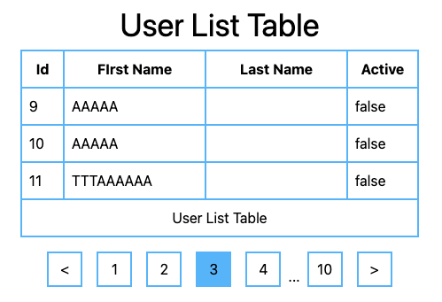
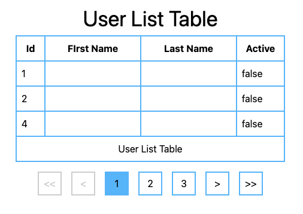

## Pagination 구현

> index.html와 index2.html을 다른 형태로 구현하였다. index2가 index에 비해 조금 더 우리나라에서 많이 사용하는 형태인 것 같다.

## index.html

## index2.html

## 🚀 Backend
[Backend Test Source](https://github.com/taeksoolee/common-api)